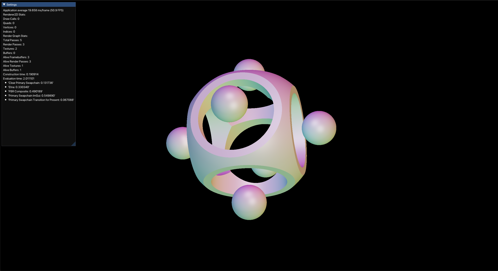

# Artifice: real-time graphics applications

# Features
- Using Vulkan, (MoltenVK on Mac)
- ImGui support (custom integration using engine), with docking and multiple viewports
- Custom data-oriented graphics abstraction over Vulkan
    - Using integer handles (RenderHandle) to represent primitives
- Custom templated Entity Component System (ECS), using archetypes to optimize for cache efficiency
- Math (vectors, matrices) written from scratch
- Custom render graph that automatically inserts barriers and synchronizes across queues
- Precomputed atmospheric scattering system using compute shaders

## **Examples** (Sandbox layers)
- 2D rendering (Sandbox2D)
- Simple pbr scene rendering (SandboxScene)
- PBR scene using real-time per-frame global cubemap for IBL generated from atmospheric scattering (SandboxAtmosphere)
- Compute shader SDF playground (Etna)
- Simple drawing application
- Notes about the atmosphere system (Atmosphere), used in SandboxAtmosphere
    - based on work of Eric Bruneton (http://www-ljk.imag.fr/Publications/Basilic/com.lmc.publi.PUBLI_Article@11e7cdda2f7_f64b69/article.pdf)
    - GLSL shader code adapted from https://github.com/Ralith/fuzzyblue

### Advanced Rendering Example

### Drawing Application

### Signed Distance Field Playground

Application architecture based on https://github.com/TheCherno/Hazel